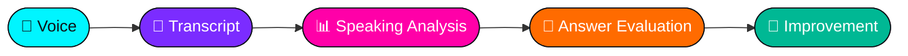
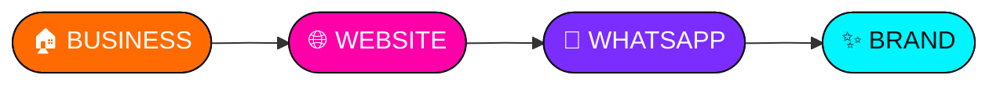
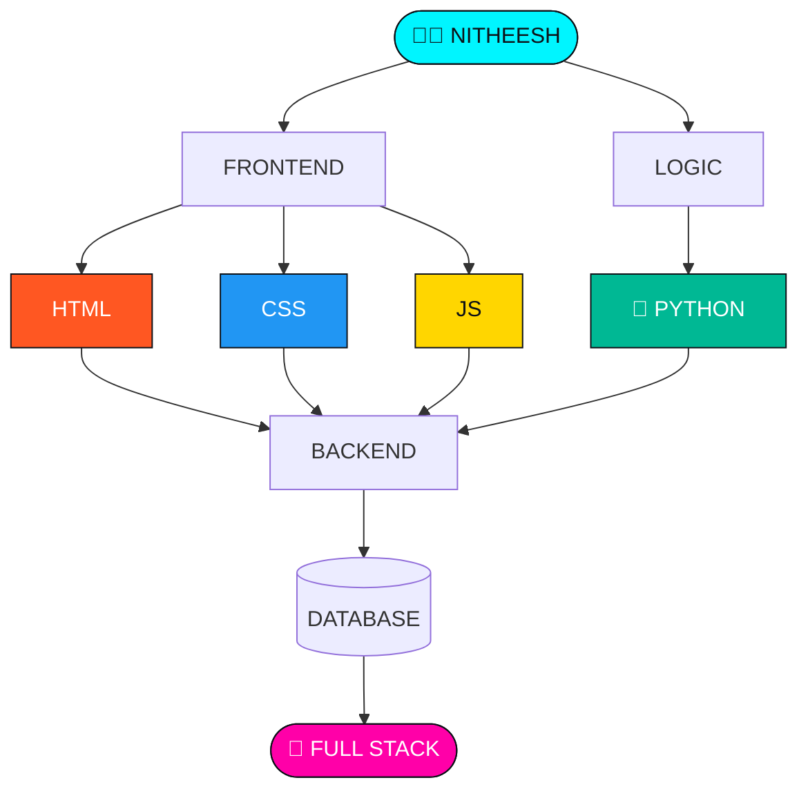

<div align="center">


<br>


</div>

---

<div align="center">

### ╔═══[ 🪪 IDENTITY CARD ]═══╗

</div>

```
┌─────────────────────────────────────────────────────────────┐
│                                                             │
│   👤 USER             : NITHEESH                            │
│   💻 CLASS            : WEB DEVELOPER                       │
│   🧠 CURRENT MODE     : LEARNING + BUILDING                 │
│   🌐 ENVIRONMENT      : WEB / PYTHON                        │
│   ⚡ POWER SOURCE     : CURIOSITY                           │
│   🎯 MISSION          : BECOME FULL-STACK                   │
│                                                             │
│   STATUS              : ████████████████████  ONLINE        │
│                                                             │
└─────────────────────────────────────────────────────────────┘
```

---

<div align="center">

## 🌈 THE COLOR OF MY CODE


<br><br>


</div>

---

<div align="center">

## 🛰️ LIVE FEED

</div>

```
[06:00] ─────────────────────────── SYSTEM
           ↓
      💡 IDEA FOUND

[06:15] ─────────────────────────── PROCESS
           ↓
      🧠 LEARNING

[07:00] ─────────────────────────── BUILD
           ↓
      💻 CODE

[08:30] ─────────────────────────── TEST
           ↓
      🧪 DEBUG

[09:00] ─────────────────────────── RESULT
           ↓
      🚀 SOMETHING NEW EXISTS
```

---

<div align="center">

## 🧪 PROJECT LAB

</div>

### 01 // AI INTERVIEW COACH 🤖
> *Turning interview practice into something measurable.*




---

### 02 // MGR BRICKS 🧱
> *A real-world business idea transformed into a digital experience.*




---

### 03 // WEB LAB 🌐
> *Small experiments today. Bigger applications tomorrow.*

 ➕
 ➕
 ➕
 = 🚀

---

<div align="center">

## 🧬 EVOLUTION TREE

</div>



---

<div align="center">

## 🧠 CURRENTLY INSIDE MY BRAIN

| | SYSTEM |
|:-:|:--|
| 🐍 | Learning Python |
| 🌐 | Improving Web Development |
| 🤖 | Building AI Interview Coach |
| 🎨 | Exploring UI/UX |
| 🔧 | Practicing Real Projects |
| 🚀 | Preparing for Full-Stack |

</div>

---

<div align="center">

## 📡 GITHUB SIGNAL


<br>


</div>

---

<div align="center">

## 🌌 THE NEXT VERSION

</div>

```
NITHEESH v1.0
      │
      ├── Learn        ✓
      ├── Experiment   ✓
      ├── Build        ✓
      ├── Fail         ✓
      ├── Improve      ✓
      │
      └──────────────► v2.0 LOADING...
```

<div align="center">

### *"There is always a better version of the code."*
### *"And a better version of me."* ⚡

<br>

<a href="https://github.com/nitheesh2315">

</a>
<a href="https://linkedin.com/in/nitheesh-g-9757543a2">

</a>

<br><br>


</div>
